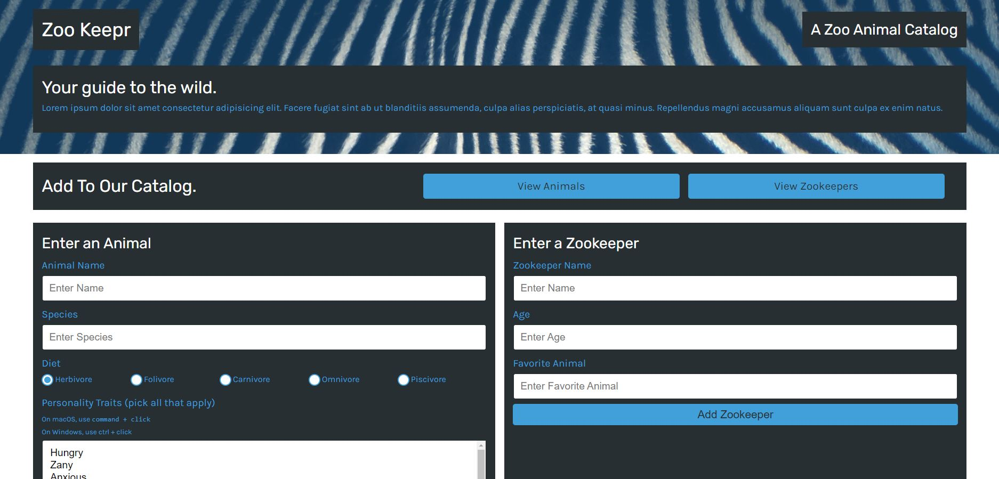
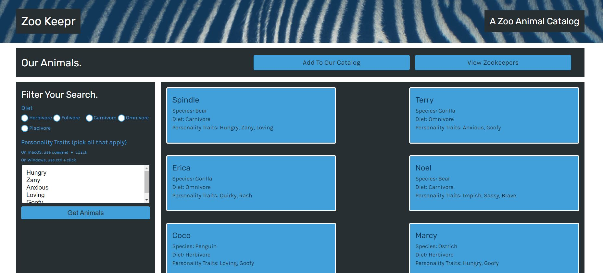
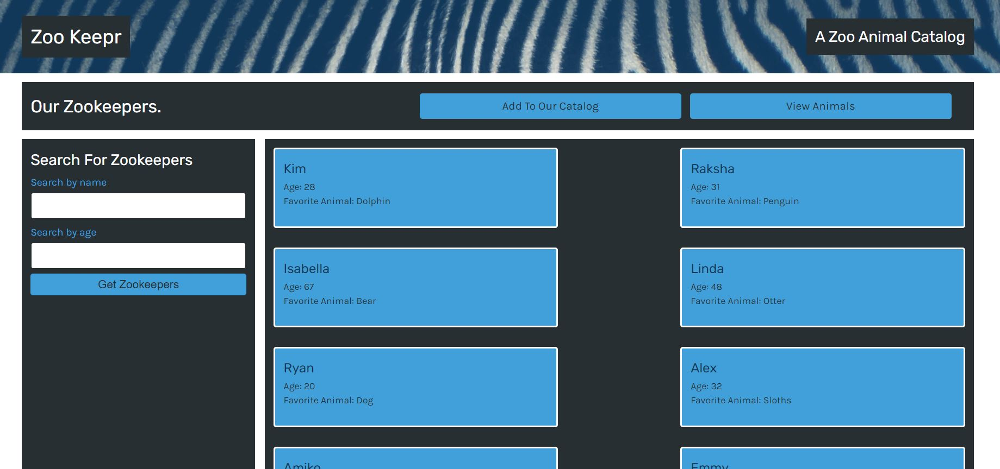

# zookeepr

## Description

In this application, I have created a web server for an online zoo catalog, called Zoo Keepr. This website allows animal enthusiasts to access the animals and zookeepers data from different locations and browsers without needing to download them to their devices.

## Table of Contents

* [Description](#description)
* [Table of Contents](#table-of-contents)
* [License](#license)
* [Screenshots](#screenshots)
* [Live-URL](#Live-URL)
* [Questions](#questions)

## License

Please see the following link for license information: 
[GitHub-license](./utils/license-MIT.txt)

## Screenshots

Please see below for the snapshots of three pages of Zoo Keepr website:

* Main Page

* View Animals

* View Zookeepers

## Live-URL

Here is the proposed live url of deployed application:
[Live URL](https://unis-zookeeper.herokuapp.com/)

## Questions

If you have any questions please use the following two links to contact me:

* [GitHub](https://github.com/unis434)

* [Email Address](mailto:unisk34@gmail.com)
